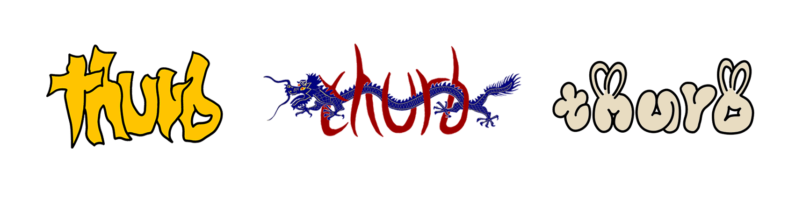
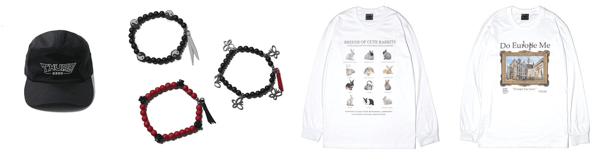

# [THURB](https://youtu.be/errE4wvT94Q)

THURB는 Thursday Rhythm & Blues 를 의미하며 일주일에 한 번( 목요일 )은 R&B를 즐기며 작업하는 디렉터의 취향을 토대로 시작되었습니다.

THURB의 라벨은 직접 선정한 다양한 음악을 QR로 제작하여 연결되어 있습니다.

이를 통해 일주일의 한 번은 음악과 함께하며 영감을 찾는 THURB Club과 함께 할 수 있습니다.  

## Signature

## Products

## Season

[2022](https://github.com/users/pory42/projects/1) 
[2023](https://github.com/users/pory42/projects/2)

## official
[Website](https://thurb.kr) 
[instagram](https://www.instagram.com/thurbstudio/)
